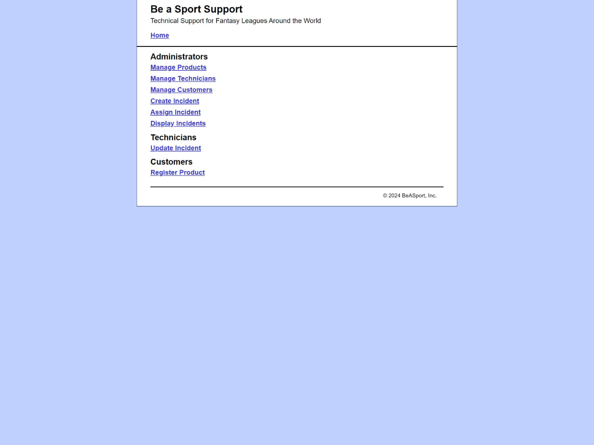

# Please read!

All the files are divided within their own labs. I already finished the whole project during the first week LOL.

However while I was doing it, the labs were closed, so I'm working on divinding the final project into smaller sections according to what X lab asks.

## TEST #1 CODE QUESTIONS

Write the PHP code that displays the variable SSN with the requisite dashes. For example, if 456123478 is stored in SSN, the display will show 456-12-3478.

```php
<?php
/// Nice, nice, nice, nice!!!
function string_to_ssn( $ssn = "111223333" ) {
    // Overuse of pre_replace, don't you think?
    $ssn = preg_replace('/[^\d]/', '', $ssn);
    $ssn = preg_replace('/^(\d{3})(\d{2})(\d{4})$/', '$1-$2-$3', $ssn);
    
    return($ssn);
}

// The SSN number
$mySSN = "456123478";

// Convert it to String in case an Int is entered
$stringConverter = (string)$mySSN;

// Call function to do magic
$convertedSSN = string_to_ssn($mySSN);

// Heeey, what's up? I'm a converted SSN dude, a new me!
echo $convertedSSN;
?>
```

Write the line of PHP code that retrieves a field named product_quantity that has been passed from a form using the GET method and does not allow users to enter decimal values.
```php
$product_quantity = intval($_GET['product_quantity']);
```

Write the PHP code to check to see if an error message exists. If it does, return to the form named customer_info.php from the current page.
```php
if (isset($_SESSION['error_message'])) {
  header('Location: customer_info.php');
  exit();
}
```

Write the PHP code for a loop that outputs the first 10 multiples of 5 separated by commas i.e. 5, 10, 15, 20, 25, 30, 35, 40, 45, 50
```php
for ($i = 1; $i <= 10; $i++) {
    echo $i * 5;
    if ($i != 10) {
        echo ", ";
    }
}
```

Write the PHP code to delete a student record from the database where the student_id is 123456789. (Include all code needed from the query to the closing of the cursor)
```php
$query = "DELETE FROM students WHERE student_id = 123456789";
$statement = $db->prepare($query);
$success = $statement->execute();
$statement->closeCursor();
```

## TEST #2 CODE QUESTIONS

A form instructs users to select all of their favorite football teams using the check boxes. Write the PHP code to determine if the user has selected the checkbox for the dallas_cowboys. (hint: see pages 215 and 243, 5 points).
```php
if(isset($_POST['dallas_cowboys'])){
    echo "Dallas Cowboys opt. selected";
} else {
    echo "Dallas Cowboys opt. not selected";
}
```

Write the PHP code for a switch statement that evaluates a variable named student_classification with values FR, SO, JR, and SR. Output should show the ranges of hours for each classification <30, 30-59, 60-89, and >90. (hint: see page 248, 10 points)
```php
$student_classification  = 'SR';
switch ($student_classification) {
    case 'FR':
        echo "Hours range: <30";
        break;
    case 'SO':
        echo "Hours range: 30-59";
        break;
    case 'JR':
        echo "Hours range: 60-89";
        break;
    case 'SR':
        echo "Hours range: >90";
        break;
}
```
## TEST #3 CODE QUESTIONS

Write the PHP code that ensures that the two letter state_code entered by the user is stored as two capital letters in the database. For example, if the user entered tx or Tx, write the line of code that will transform it to TX.
```php
$state_code = 'tx';
echo strtoupper($state_code);
```

Write the PHP code to generate a random number between 1 and 100.
```php
$randomNumber = rand(1, 100);
echo $randomNumber;
```

Write the PHP code to determine if a coupon has expired.  The coupon expires on the last day of the month.  If the coupon is valid, set the discount variable to %5 off.  If not, set the discount variable to 0% off and echo a message that the coupon has expired. (HINT: strtotime() function will be really helpful!)
```php
$coupon = "2024-12-31"; // Coupon expiration date

if (strtotime($coupon) >= strtotime('last day of this month')) {
    echo $discount = "5% off"; // Coupon is valid
} else {
    $discount = "0% off"; // Coupon has expired
    echo "Sorry, the coupon has expired.";
}
```
